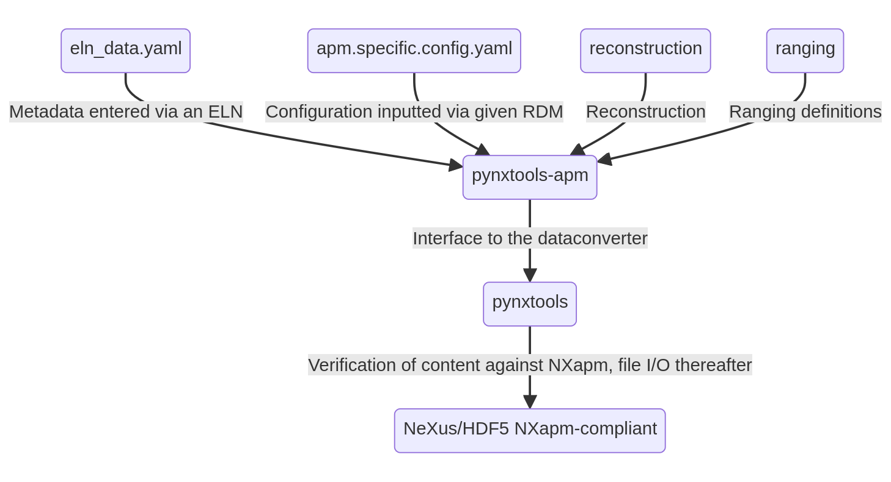

# Scope and idea

pynxtools-apm offers the atom probe community a set of diverse examples that show how to standardize the diverse (meta)data from the research field of atom probe and field-ion microscopy to one representation. We would like to encourage the community to share example files with us. Ideally, these should be small and should come from diverse use cases and file formats.

We are working together with the [International Field Emission Society's (IFES) Atom Probe Technical Committee (APT TC)](https://fieldemission.org/article.php?id=technical_committee) to improve the capabilities of the readers for the benefit of all atom probers.

## Workflow

The following diagram shows how `pynxtools-apm` processes data and metadata from different sources and how the plugin interacts with the core routines that are implemented in `pynxtools`.

